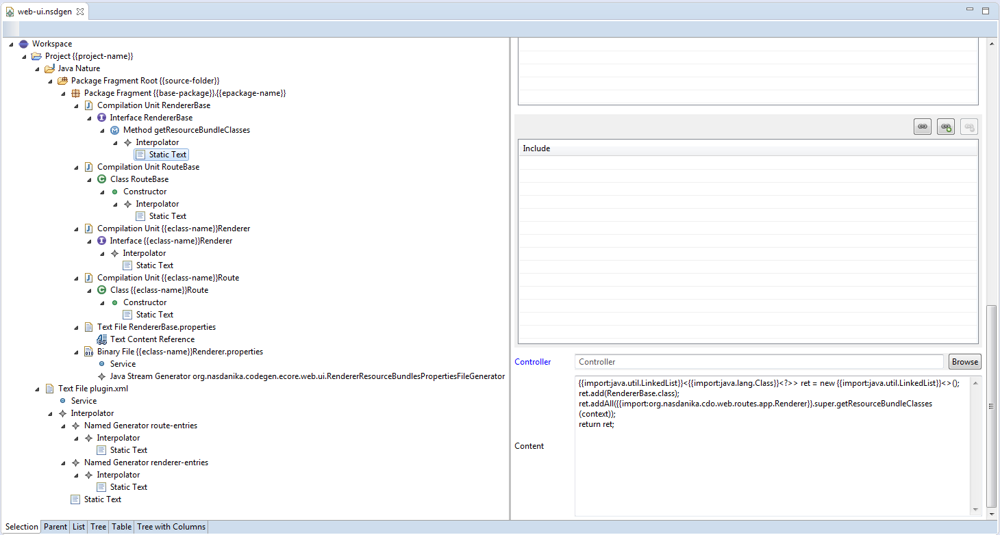

# Nasdanika Code Generation

Nasdanika Code Generation provides an Ecore model which encapsulates generation of Eclipse projects, folders, files, packages, compilation units, ...
It also provides an editor for the model. Code can be generated from a model by using context menu item and then supplying input configuration either as a file or interactively
through UI dialogs.

## Concepts 

The model contains generators and filters. Filter is a generator which contains another generator and performs some processing on the contained generator output to produce its own output. 
Please consult the [model API documentation](http://www.nasdanika.org/products/codegen/apidocs/org.nasdanika.codegen/apidocs/) for the complete list of model elements.

In the model generators are organized in a tree, e.g. workspace "generator" (it doesn't actually generate anything) may contain project generators, which in turn may contain file, folder, and nature generators.

Java nature generator may contain package fragment roots generators, which contain package fragment generators, which in turn contain compilation unit generators.

Maven nature may contain pom.xml generator.

[Generator](http://www.nasdanika.org/products/codegen/apidocs/org.nasdanika.codegen/apidocs/org/nasdanika/codegen/Generator.html) extends [Configuration](http://www.nasdanika.org/products/config/apidocs/org.nasdanika.config/apidocs/org/nasdanika/config/Configuration.html?is-external=true) and as such may contain configuration items - properties, services, and configuration categories.

Generation works in the following way:

* Generators create [Work](http://www.nasdanika.org/products/codegen/apidocs/org.nasdanika.codegen/apidocs/org/nasdanika/codegen/Work.html).
* Work takes [Context](http://www.nasdanika.org/products/config/apidocs/org.nasdanika.config/apidocs/org/nasdanika/config/Context.html?is-external=true) and progress monitor as its ``execute()`` method arguments. 
* Because Generator extends Configuration, it has createContext() method. When generator's work is executed it receives a context created by its generator with container generator context as its parent. The top level generator receives its context from the client code, e.g. from the model editor. What it means is that each child generator inherits properties and services from its parent generator. 

### Name interpolation

Some generators, e.g. project generator, have name attribute. During generation the name attribute value gets interpolated to produce the name of the generated artifact, e.g. workspace project.
Interpolation means expanding ``{{<property name>[|<default value>]}}`` tokens to the value of the property with the specified name from the generation context. Interpolation makes iteration (see below) possible.    

### Reconcile action and merging

Reconcile action attribute allows to specify what to do if an artifact about to be generated already exists. One of options is "Merge". 
If "Merge" is selected the generator must contain ``merger`` services implementing [Merger](http://www.nasdanika.org/products/codegen/apidocs/org.nasdanika.codegen/apidocs/org/nasdanika/codegen/Merger) interface, which would combine generated and existing artifact content.

### Controller

All generators have [Controller](http://www.nasdanika.org/products/codegen/apidocs/org.nasdanika.codegen/apidocs/org/nasdanika/codegen/Generator.html#getController--) attribute which may contain a name of Java class implementing [GeneratorController](http://www.nasdanika.org/products/codegen/apidocs/org.nasdanika.codegen/apidocs/org/nasdanika/codegen/GeneratorController) interface for generators and [GroupController](http://www.nasdanika.org/products/codegen/apidocs/org.nasdanika.codegen/apidocs/org/nasdanika/codegen/GroupController) interface for groups.

Controllers allow to validate the generator configuration before execution, execute generator work zero or more times with different contexts, and configure results of execution.

### Modification tracking

If resource generator context contains [ResourceModificationTracker](http://www.nasdanika.org/products/codegen/apidocs/org.nasdanika.codegen/apidocs/org/nasdanika/codegen/ResourceModificationTracker.html) service, then this service is used for tracking resource modifications. Modification tracking allows generators to overwrite resources which haven't been modified since last generation and preserve them, confirm overwrite or merge otherwise.

Resource modification tracker is added to the context of [Project](http://www.nasdanika.org/products/codegen/apidocs/org.nasdanika.codegen/apidocs/org/nasdanika/codegen/Project.html) and inherited by its children. Resource modifications are stored in ``.settings/org.nasdanika.codegen.resourceStamps.properties`` file in the form of ``<file path>=<file SHA-256 digest>``.  

## Creating a model

* Install Configuration editor from ``http://www.nasdanika.org/products/codegen/repository``.
* File > New > Other > Nasdanika/Code Generation Model.
* Select the root model element. If the model is going to be used to generate code from the editor, select "Workspace". 
* Add child elements to the root and configure.
* Right-click on the model root or other model element and select "Validate" context menu item to validate the model.

## Generating code

### From the editor
    
* Right-click on the model root or other model element and select "Generate". 
* Enter values for unbound properties to a dialog when requested.

If the project containing the generation model is a Java project, then Java classes defined in the project or referenced by the project are available in the generators context class loader.

### Programmatically

See [WebUIGenerationTarget.execute()](https://github.com/Nasdanika/codegen-ecore-web-ui/blob/master/org.nasdanika.codegen.ecore.web.ui/src/org/nasdanika/codegen/ecore/web/ui/WebUIGenerationTarget.java#L90) method:

* Load the model.
* Call ``Generator.createWork()``.
* Call ``Work.execute()`` providing context and monitor.    

## API Documentation

* [Model](http://www.nasdanika.org/products/codegen/apidocs/org.nasdanika.codegen/apidocs/)
* [Edit](http://www.nasdanika.org/products/codegen/apidocs/org.nasdanika.codegen.edit/apidocs/)
* [Editor](http://www.nasdanika.org/products/codegen/apidocs/org.nasdanika.codegen.editor/apidocs/)

## Example

[Codegen Ecore Web UI Generation Target](https://github.com/Nasdanika/codegen-ecore-web-ui) - This project contains a model which generates routes, renderers and resource sets for [Nasdanika Application Rendering Framework](https://github.com/Nasdanika/server/blob/master/org.nasdanika.cdo.web/doc/application-rendering.md) from an Ecore model.

Below is a screenshot of the generator model:

